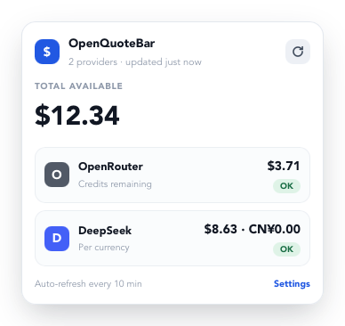
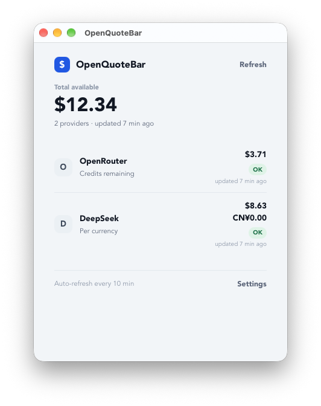
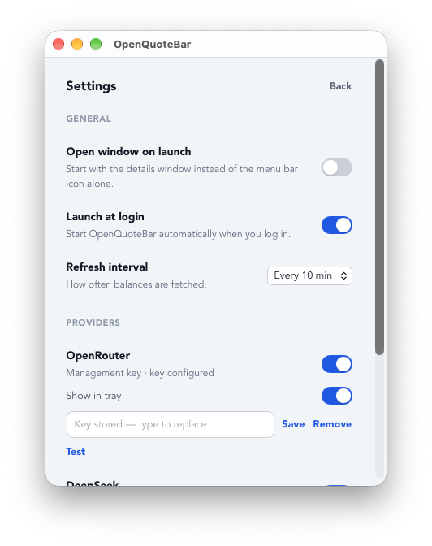

# OpenQuoteBar

A lightweight menu bar / system tray app (macOS and Windows) that keeps your **remaining LLM API
credits** in sight, without opening a dashboard per provider.

If you top up several providers, finding out how much you have left means signing in to each one in
turn. OpenQuoteBar reads them for you and shows a single, always-current number in the menu bar,
with a per-provider breakdown one click away.

It is deliberately boring about the things that matter:

- **Provider-agnostic.** Every provider is an adapter behind one small interface, so supporting a
  new one never touches the core or the UI. See the [roadmap](#roadmap--to-build) for what is next.
- **Local-first.** No account, no telemetry, no server. The only network calls are the balance
  requests to the providers you enable.
- **Secrets stay in the OS.** API keys live in the macOS Keychain or Windows Credential Manager,
  never in a config file and never in the UI — it only ever learns _whether_ a key is stored.
- **Honest numbers.** Amounts are never invented: different currencies are shown side by side and
  never summed, a provider that fails keeps showing its last known value, and a key with nothing to
  report says so instead of showing a confident `0`.

> Linux is out of scope for now.

## Features

- Menu bar / tray icon with a rich popover: the consolidated total plus one tile per provider.
- A details window with the same breakdown, a **Refresh** button, and per-provider status.
- Background refresh every 5–15 minutes (default 10), with **Refresh now** from the tray.
- Per-provider enable/disable, and an opt-in **Show in tray** switch so the menu stays short.
- Test a provider's credentials from Settings and read the exact reason a fetch failed.
- Launch at login and "open the window on launch" preferences.

Supported providers today: **OpenRouter** and **DeepSeek**.

## Screenshots

| Menu bar popover                                                            | Details window                                                                             | Settings                                                                                           |
| --------------------------------------------------------------------------- | ------------------------------------------------------------------------------------------ | -------------------------------------------------------------------------------------------------- |
|  |  |  |

## Status

Working app, version `0.3.0`. The foundation is in place — provider adapters, secure key storage,
the polling loop with cached values, the tray popover and the settings view. The current focus is
breadth: more providers, tracked in [Roadmap / To build](#roadmap--to-build).

## Roadmap / To build

The architecture is built so that **adding a provider is one self-contained adapter**: it implements
[`ProviderAdapter`](src-tauri/src/adapters/mod.rs) and returns a normalized `BalanceSnapshot`, and
nothing in `core/` or the UI has to change. What follows is the list of providers worth adding,
grouped by how easily each one can be read.

Endpoints are listed to scope the work — confirm them against each provider's current docs before
implementing, since providers move APIs around.

### Already supported

| Provider   | How the balance is read                                                |
| ---------- | ---------------------------------------------------------------------- |
| OpenRouter | `GET /api/v1/credits` (management key) or `GET /api/v1/key` (per-key). |
| DeepSeek   | `GET /user/balance` — one entry per currency.                          |

### Next — a real balance endpoint, readable with a normal API key

The ideal shape: one GET with an ordinary key returns the remaining balance.

| Provider        | Endpoint                                 | Balance field(s)                                       |
| --------------- | ---------------------------------------- | ------------------------------------------------------ |
| Moonshot (Kimi) | `GET /v1/users/me/balance`               | `available_balance`, `voucher_balance`, `cash_balance` |
| Novita AI       | `GET /openapi/v1/billing/balance/detail` | `availableBalance` (unit is 1/10000 USD)               |
| Hyperbolic      | `GET /v2/customer/balance`               | response schema to confirm                             |
| DeepInfra       | `GET /v1/me?checklist=true`              | `checklist.stripe_balance` (sign inverted)             |

### Then — an admin/management key, or a usage report to interpret

Here the credential is not the ordinary inference key, so the adapter has to explain what to store,
and the figure shown is often a derived spend or a quota rather than a true prepaid balance.

| Provider    | Endpoint(s)                                                                | Credential                     |
| ----------- | -------------------------------------------------------------------------- | ------------------------------ |
| xAI (Grok)  | `GET /v1/billing/teams/{team_id}/prepaid/balance` on `management-api.x.ai` | Management key + team id       |
| Anthropic   | `GET /v1/organizations/cost_report`, `/usage_report/messages`              | Admin API key                  |
| OpenAI      | `GET /v1/organization/costs`, `/usage/...`                                 | Admin key (`sk-admin-…`)       |
| Mistral AI  | `GET /v1/admin/usage?month=&year=`                                         | Admin key                      |
| Together AI | `GET /v1/billing/usage?month=YYYY-MM`                                      | Org-scoped key (beta)          |
| ElevenLabs  | `GET /v1/user/subscription`                                                | Normal key (quota, not credit) |
| Perplexity  | analytics `.../computer/usage`                                             | Org analytics key              |

### Cloud billing — a different kind of integration

Providers whose spend lives in a cloud account (Vertex AI, Azure OpenAI, AWS Bedrock) expose no
service-level balance; reading it means the cloud provider's own billing API (Cloud Billing, Cost
Management, Cost Explorer) with cloud credentials. That is a large, separate scope and is not
planned in the near term.

### Not applicable / no public API

Groq, Cerebras, Cohere, Replicate, Fireworks, Zhipu/GLM, Alibaba DashScope, Nebius, Voyage, Jina and
Runway expose no documented way to read a balance from a normal key. Google AI Studio's free tier
has rate limits but no balance. Local runtimes (Ollama, LM Studio) have no account at all. These are
listed so the "why not X?" question has an answer.

### Beyond providers

Smaller items tracked alongside the provider work:

- Real code signing for macOS and Windows — the release workflow is already structured for it.
- Translations; the UI's user-facing strings already live in one module (`src/strings.ts`).

## Prerequisites

- **Rust** stable 1.88+ — via [rustup](https://rustup.rs/) or your package manager.
- **Node.js 20+** and **pnpm**.
- **macOS** — Xcode Command Line Tools (`xcode-select --install`).
- **Windows** — WebView2 (preinstalled on Windows 11) and the Microsoft C++ Build Tools with the
  "Desktop development with C++" workload.

## Getting started

```bash
pnpm install
pnpm tauri dev
```

## Scripts

| Command                            | What it does                                          |
| ---------------------------------- | ----------------------------------------------------- |
| `pnpm tauri dev`                   | Run the app in development (Vite + Tauri).            |
| `pnpm tauri build`                 | Build the macOS / Windows bundles.                    |
| `pnpm typecheck`                   | Type-check the frontend (`tsc --noEmit`).             |
| `pnpm lint`                        | Lint the frontend with ESLint.                        |
| `pnpm format` / `format:check`     | Write / verify Prettier formatting.                   |
| `pnpm rust:fmt` / `rust:fmt:check` | Format / verify the Rust code.                        |
| `pnpm rust:clippy`                 | Lint the Rust code with Clippy (warnings are errors). |
| `pnpm check`                       | Run every check above in one go.                      |

## Configuration

Two files live in the OS app config directory — `~/Library/Application Support/com.openquotebar.app/`
on macOS, `%APPDATA%\com.openquotebar.app\` on Windows:

| File               | Written by | Purpose                                       |
| ------------------ | ---------- | --------------------------------------------- |
| `config.toml`      | you        | Providers the app reads, and their options.   |
| `preferences.json` | the app    | Window and startup preferences set in the UI. |

`config.toml` is created on first run:

```toml
[[providers]]
id = "openrouter"
enabled = true
show_in_tray = false
key_type = "management"

[[providers]]
id = "deepseek"
enabled = true
show_in_tray = false
```

`id` must match an adapter bundled with the app, and `enabled` decides whether the app reads that
provider's balance. `show_in_tray` (optional, default `false`) decides whether that provider's
balance shows up in the tray menu preview. `key_type` is OpenRouter-specific: `management` reads the
account-wide credits endpoint, `standard` reads the per-key limit instead.

**API keys are never written to that file.** They are stored in the OS credential store — macOS
Keychain, Windows Credential Manager — under the service `com.openquotebar.app`, one entry per
provider id. Add, replace or remove them from the Settings view; the backend only ever tells the UI
_whether_ a key is stored, never the key itself. On macOS you can inspect an entry directly:

```bash
security find-generic-password -s com.openquotebar.app -a openrouter
```

Editing `config.toml` by hand is supported. Note that toggling a provider from the app rewrites the
file from its parsed values: the documented header is preserved, but comments added inside the
provider entries are not.

Each provider row in Settings also has a **Test** button, which fetches the current balance using the
stored key and reports either the amount or the reason it failed. The provider adapters live in
`src-tauri/src/adapters/`; each one is behind the same `ProviderAdapter` trait and returns a
normalized `BalanceSnapshot`, so the UI never has to know how a provider expresses "balance". A
snapshot carries one amount per currency — DeepSeek can report both USD and CNY — and amounts in
different currencies are never summed together.

## Refreshing

Balances are refreshed by a background loop that runs a cycle as soon as the app starts and then
every 5 to 15 minutes, according to the **Refresh interval** in Settings (default: 10). Providers are
fetched concurrently, and the tray menu's **Refresh now** triggers a cycle immediately. The tray
tooltip mirrors the state — updating, how many providers, how many are failing, and when the values
were last refreshed.

The tray menu itself previews the providers whose **Show in tray** switch is on, one row per provider
with its last known balance. A provider that reports several currencies — DeepSeek can hold both USD
and CNY — shows them side by side, and a currency that reads as zero is dropped when another one has
money, the same rule the window's totals follow. The switch is per provider (the `show_in_tray`
option in `config.toml`) and off by default, so the menu stays short until you opt a provider in.

A failed fetch never clears the last value it managed to read: the cache keeps the previous snapshot
and records the error alongside it, so a provider that is briefly unreachable keeps showing the
balance you already knew about.

## Building

```bash
pnpm install
pnpm tauri build
```

That produces the installers for the machine you are on:

| Platform | Artifacts                                                              |
| -------- | ---------------------------------------------------------------------- |
| macOS    | `src-tauri/target/release/bundle/dmg/*.dmg` and `.../macos/*.app`      |
| Windows  | `src-tauri/target/release/bundle/msi/*.msi` and `.../nsis/*-setup.exe` |

The macOS bundle is signed **ad-hoc** (`bundle.macOS.signingIdentity = "-"`), which is what stops
Apple Silicon builds downloaded from a release from being reported as damaged. It is not a real
signature: macOS still asks the user to allow the app the first time (System Settings → Privacy &
Security → Open Anyway), and Windows SmartScreen warns about an unknown publisher. Real signing is
deliberately out of scope for now, but the workflow is ready for the certificates once they exist.

Linux is not supported.

## Releases

Releases are built by GitHub Actions:

- `.github/workflows/ci.yml` runs the checks and tests on macOS and compiles and tests the backend on
  Windows, on every push to `main` and every pull request. It does not exercise the tray or the
  autostart integration, which need a real desktop.
- `.github/workflows/release.yml` runs on a `v*` tag, builds a universal macOS DMG plus the Windows
  installers, and opens a **draft** release with the artifacts and the changelog.

To cut a release:

1. Bump `version` in `package.json` **and** `src-tauri/Cargo.toml`. The app itself reads the version
   from `package.json`, through `tauri.conf.json`.
2. Regenerate the changelog with `pnpm changelog` (needs [`git-cliff`](https://git-cliff.org)).
3. Commit, then tag and push:

   ```bash
   git tag v0.2.0
   git push origin main --tags
   ```

4. Review the draft release and publish it.

The workflow fails the run when the tag does not match the version in `package.json` and
`Cargo.toml`, so a release can never claim a version the app does not report.

## Icons

The artwork lives in `design/` as two SVGs, and those are the source of truth:

| File                   | What it is                                            |
| ---------------------- | ----------------------------------------------------- |
| `design/app-icon.svg`  | The app mark: a dollar sign on a blue rounded square. |
| `design/tray-icon.svg` | The same sign, monochrome, for the macOS menu bar.    |

Regenerate the platform assets after editing either of them:

```bash
pnpm tauri icon design/app-icon.svg
pnpm tauri icon design/tray-icon.svg -p 88 -o src-tauri/icons/tray
```

The second command produces the PNG the tray embeds. It is 88 px rather than 22 or 44 because the
tray layer normalises the image to 18 points of height and scales the width to match, so a
generously sized square is what keeps it crisp at every display density.

On macOS the tray icon is a _template image_: the system uses its alpha channel as a mask and tints
it for light and dark menu bars, which is why the tray source is monochrome. Windows has no
equivalent, so it gets the app mark, which has its own background and reads on any taskbar colour.

## Project layout

```
.
├── index.html            # webview entry point
├── src/                  # frontend: Vite + TypeScript (no framework)
└── src-tauri/
    ├── tauri.conf.json   # app configuration (identifier, window, bundle)
    ├── capabilities/     # Tauri 2 permissions
    └── src/
        ├── main.rs       # binary entry point
        ├── lib.rs        # Tauri builder + command registration
        ├── core/         # provider-agnostic domain types and state
        ├── adapters/     # provider integrations (one adapter per provider)
        └── ui/           # Tauri commands the webview calls
```

## IDE setup

[VS Code](https://code.visualstudio.com/) with
[Tauri](https://marketplace.visualstudio.com/items?itemName=tauri-apps.tauri-vscode) and
[rust-analyzer](https://marketplace.visualstudio.com/items?itemName=rust-lang.rust-analyzer).
